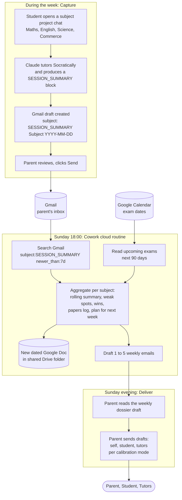

# Weekly Study Dossier — a Claude-driven system for parents

A weekly Sunday-evening routine that turns your child's actual study
sessions into three differentiated emails: a full dossier with reasoning
to you, a focused brief to each subject tutor, and a motivating
forward-looking plan to your child.

It runs on Anthropic's [Cowork](https://www.anthropic.com/) cloud
routines, reads three Claude projects (one per subject) plus a Google
Calendar of upcoming exams, updates a shared Google Doc dossier, and
sends the emails — all on Sunday evening, with no laptop required after
setup.

> Built for one specific Year 10 student in Australia. The whole repo is
> a redacted template — every name, email, school, and date is a
> `{{...}}` placeholder. Fork it, drop in your own
> [config/personal.yml](config/personal.example.yml), and adapt.

## Working architecture — push-via-Gmail (May 2026)

The original architecture for the weekly feedback loop assumed the
Sunday Cowork routine could read Claude project chats directly and
update a rolling Google Doc. The first real-run dry test surfaced both
as false: there's no API surface for project-chat reads from Cowork,
and the Drive connector is read-only for content. The architecture
pivoted:

- **Capture (during the week):** each subject's project instructions
  tell Claude to draft a Gmail to the parent at end-of-session, with
  subject prefix `[SESSION_SUMMARY]` and the structured summary block
  in the body. Parent reviews the draft (~10 sec) and clicks Send.
- **Aggregate (Sunday routine):** the routine searches Gmail by
  subject prefix instead of reading project chats. Same data, different
  source.
- **Persist (Sunday routine):** the routine creates one new dated doc
  per week inside a shared Drive folder, instead of updating a rolling
  doc. The folder is the chronological archive.
- **Deliver (Sunday routine):** the routine produces Gmail *drafts* for
  parent / student / tutor, never auto-sends. Parent ACKs each.

Why this is in the README and not just the design history: anyone
forking this repo needs to see at a glance which architecture they
are building (push, not pull). The pivot only happened inside the
third iteration of the system; the broader iteration story is in the
[Why](#why-how-and-what-follows) section below. The full write-up
of the architecture pivot itself is
[Decision 10 in design-history.md](docs/design-history.md#decision-10-push-via-gmail-not-pull-from-projects-architecture-pivot-may-2026).

## How it works (end-to-end)



Two things worth noting in the diagram:

- **Two human ACK loops.** The parent clicks Send twice in the flow:
  once per session-summary email during the week, once for the weekly
  dossier on Sunday. This is the design choice from Decision 10. No
  autonomous send.
- **The architecture has no read access to project chats.** The Capture
  block (top) produces emails that the Sunday routine (middle) consumes.
  Project chats themselves are private to the student and never seen
  by the routine. This was a deliberate response to the architecture
  pivot inside this iteration of the system. See the
  [Why](#why-how-and-what-follows) section for the broader
  three-iteration story this pivot sits inside.

## Why, how, and what follows

### Why

I have a Year 10 son. He works hard, has good tutors, and a clear
academic ceiling above where he currently sits. Between school, three
subjects of tutoring, and self-study, there are a lot of moving parts
and a lot of feedback that never reaches the same place. I am a working
parent. I cannot be the integration layer.

The system you see in this repo is the third iteration of the idea.
The first was an AI answer machine, which failed pedagogically: a 15
year old with frictionless access to answers stops doing the work that
makes learning happen. The second was a Socratic tutor per subject,
which worked at the chat level but produced no visibility for parents
or tutors. The third is this: Socratic tutoring with a weekly feedback
loop that surfaces what happened to me, to him, and to his tutors. The
architecture you see in this repo is itself the second design of that
third iteration. The first design tried to pull data out of project
chats and failed on the first real run. Decision 10 in
[docs/design-history.md](docs/design-history.md) documents that pivot.

This started concrete. I built one practice exam paper, marked his
attempt, and saw patterns within thirty minutes. A second harder paper
confirmed them. A third targeted them. By then the question was no
longer "can I see what he needs to work on" but "can that pattern
recognition be sustained without me sitting beside him every Sunday."
The thesis behind this repo: yes, with three conditions.

1. **AI as the integration layer, not the teacher.** The Socratic
   stance is non-negotiable. The system refuses to write essays,
   refuses to solve homework problems for submission, and hints rather
   than answers. If it became the path of least resistance it would
   replace struggle with comfort, which is the opposite of learning.

2. **The parent stays in the loop.** Every datapoint that ends up in
   the weekly dossier passed through a parent's hand. The architecture
   has two human-ACK points by design (one during the week per session
   summary, one on Sunday for the weekly dossier). The system is
   leverage, not autonomy.

3. **Honest by default.** When there is no data, the dossier says so.
   When the routine is uncertain, it flags uncertainty. The
   [things we got wrong](docs/design-history.md) section of the design
   history is part of the value, not a bug.

### How

See the [diagram](#how-it-works-end-to-end) and the
[Working architecture](#working-architecture--push-via-gmail-may-2026) section
above. The short version: four Claude projects (one per subject) draft
per-session summary emails. A Sunday Cowork cloud routine reads those
emails plus the exam calendar, creates a dated snapshot doc, and drafts
differentiated emails for parent, student, and tutors. The parent
reviews and sends. The whole thing is open-source, redacted, forkable.

### What follows

**For other parents thinking about this:** start with a real practice
paper, not an architecture diagram. The system shape matters less than
the discipline behind it; the dossier is downstream of the child
actually doing work. Get the Socratic stance right and the rest is
plumbing. Get it wrong and you have built a homework-completion engine.

**For AI builders watching:** the lessons generalise beyond a family
study system. Verify your primitives before designing around them. When
introspection isn't possible, flip from pull to push. Treat
human-in-the-loop as a feature, not a defect. Calibration windows beat
go-live confidence. And the
[design history](docs/design-history.md) is more useful than the spec,
because it shows which assumptions failed and why.

**For me, going forward:** three Sunday calibration runs on real data
before flipping the system to multi-recipient. A quarter of real use
before deciding whether it earns its place in the family's week. If my
son disengages from the projects, no tooling change fixes that. The
honest response is a conversation, not a prompt edit. If it does work
for him, the design generalises, which is the open-source bet behind
making this repo public.

## What you need

- An Anthropic Max subscription with Cowork enabled
- A Google account (for Calendar, Docs, Gmail)
- Roughly 90 minutes for the initial setup
- A willingness to spend ~3 weeks calibrating before going live to your
  child and tutor

## Repository layout

```
docs/
  design-history.md            Why the system is shaped the way it is
  build-plan.md                Phased rollout with Definition of Done per phase
  Final_1_Routine_Prompt.md    Cowork prompt — the heart of the system
  Final_2_Dossier_Doc_Template.md
  Final_3_Email_Templates.md
  Final_4_Setup_Instructions.md
  Final_5_Project_Instruction_Updates.md
  Final_6_Calendar_Setup_Guide.md
config/
  personal.example.yml         Placeholder schema (committed)
  personal.yml                 Real values (gitignored — you create this)
LICENSE                        MIT — fork freely
```

## Quick start

1. **Fork or clone** this repo.
2. **Copy** `config/personal.example.yml` → `config/personal.yml` and
   fill in your real values. `personal.yml` is gitignored — your data
   never leaves your machine.
3. **Read** [docs/design-history.md](docs/design-history.md) first.
   The non-negotiable design choices (Socratic stance, RAG over project
   knowledge, three-recipient email split) are explained there. Don't
   weaken them without understanding why they exist.
4. **Follow** [docs/build-plan.md](docs/build-plan.md) phase by phase.
   Every phase has an explicit Definition of Done — don't skip ahead.

## Read order during setup

1. [docs/design-history.md](docs/design-history.md) — context and
   non-negotiable design choices.
2. [docs/build-plan.md](docs/build-plan.md) — the executable plan,
   8 phases (0–7), each with DoD.
3. [docs/Final_4_Setup_Instructions.md](docs/Final_4_Setup_Instructions.md)
   — step-by-step browser walkthrough that the build plan references.
4. [docs/Final_6_Calendar_Setup_Guide.md](docs/Final_6_Calendar_Setup_Guide.md)
   and [docs/Final_2_Dossier_Doc_Template.md](docs/Final_2_Dossier_Doc_Template.md)
   for the two external surfaces.
5. [docs/Final_5_Project_Instruction_Updates.md](docs/Final_5_Project_Instruction_Updates.md)
   for the `[SESSION_SUMMARY]` block that goes into each project's
   instructions.
5b. [docs/project-instructions.md](docs/project-instructions.md) — the
   three full subject-instruction blocks (Maths / English / Science),
   ready to paste into each project. Bundles the Socratic stance, RAG
   grounding, session-summary format, and shared-laptop note.
6. [docs/Final_1_Routine_Prompt.md](docs/Final_1_Routine_Prompt.md) —
   the prompt to paste into Cowork. Fill placeholders from
   `config/personal.yml`.
7. [docs/Final_3_Email_Templates.md](docs/Final_3_Email_Templates.md)
   for the expected output shape during calibration.

## Architecture decisions you should know up front

- **Single Max account on the parent's laptop.** The child borrows the
  laptop. No second subscription needed.
- **Three separate email recipients** (parent, child, each tutor) with
  three different framings of the same data.
- **Each project has shared-laptop hygiene built into its instructions**
  — it gently redirects non-study questions out of the project chat.
- **The routine prompt scopes search to the three named projects only**
  — non-project chats on the same account are out of scope.
- **A separate `docs/student-guide.md`** (created at Phase 6) gives the
  child a frank shared-account note: "your project chats are visible to
  your parent — that's the point."
- **Personal data lives in `config/personal.yml` (gitignored).** The
  committed tree is fully redacted.

## Maintenance cadence

- **Weekly (5–10 min):** read the Sunday email; act on or push back on
  the top recommendation.
- **Monthly:** spot-check Gmail / Docs / Calendar connector auth in
  Claude settings; tokens drift.
- **Per term:** refresh project knowledge (chapters, syllabus). Confirm
  exam calendar against the school portal.
- **Quarterly:** re-read [docs/design-history.md](docs/design-history.md)
  and ask whether any decision should be revisited.

### Connector verification log

| Date | Connectors verified | Notes |
|------|---------------------|-------|
| 2026-05-04 | Gmail, Google Docs, Google Calendar | Phase 1 smoke tests passed (list calendars, list recent Drive files, draft Gmail). Re-check on first routine failure or quarterly. |

## Calibration log

Append one row per Sunday during the calibration window
(see [docs/build-plan.md](docs/build-plan.md) Phase 5):

| Date | Verdict (would-have-sent / hold) | Prompt edits | Scope leakage check |
|------|----------------------------------|--------------|---------------------|
|      |                                  |              |                     |

## Adapting this for your family

The placeholder pattern means almost everything is parameterised. The
parts most likely to need real changes:

- **Subjects.** This template assumes Maths / English / Science. If
  your child takes different subjects, rename the three Claude projects
  and adjust subject-specific bits of the routine prompt
  ([Final_1](docs/Final_1_Routine_Prompt.md)).
- **Curriculum.** This was built for Australian NESA Stage 5
  (Year 10). Other curricula will have different notation, marking
  conventions, and rubric language — upload your child's actual
  textbook and rubric to project knowledge so Claude grounds in the
  right material.
- **Error taxonomy.** [Final_5](docs/Final_5_Project_Instruction_Updates.md)
  defines seven error categories. If your child's errors look
  different, edit that taxonomy *before* the routine starts collecting
  data, otherwise patterns won't aggregate cleanly.
- **Tone.** Tutor and child emails have specific tone guidance in
  [Final_1](docs/Final_1_Routine_Prompt.md). Tune to your family.

## Contributing

Pull requests welcome — especially:

- Adaptations for other curricula (UK GCSE, US APs, IB, etc.)
- Improvements to the error taxonomy
- Failure modes you encountered that aren't covered in
  [docs/design-history.md](docs/design-history.md) "If something breaks,
  read this"

## License

[MIT](LICENSE). Fork freely.
